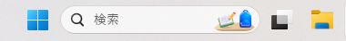

# 分析方法
ここではプログラミング言語以外での分析方法について解説する。

## 分析の準備
データ分析する際は、大きい・多くのパソコン画面があるとないとで作業効率が大きく異なる。作業効率を上げる簡単な方法、1. デュアルディスプレイ、2. バーチャルデスクトップの2つを紹介する。

### デュアルディスプレイ
ディスプレイモニターを別途購入しパソコンに接続することで画面を拡大できる。安いもので十分対応できる。

### バーチャルデスクトップ
バーチャルデスクトップは1つのパソコン画面で複数の画面を使える機能。Windows11だとタスクバーに黒い四角形と白い四角形が重なっているアイコンがある。ここをクリックすると現在表示されている画面と新しいデスクトップが表示されるので、'+'をクリックすると新しいデスクトップが作成される。

```{r virtual, echo=FALSE, fig.cap="Windows11でのタスクバー", fig.align='left'}
library(tidyverse)


```

操作方法：<br>
左隣のデスクトップに移る：[Windows] + [Ctrl] + [←]<br>
右隣のデスクトップに移る：[Windows] + [Ctrl] + [→]

デュアルディスプレイとバーチャルデスクトップの2つを使っていると一つの画面で作業する何倍ものスピードで作業できる点でお勧めする。

### 注意点
メモリーが小さいパソコンだと、同時作業できる量が限られる。メモリーが16BGか32GBだと安心して作業できる。 

## データ打込み
データ打ち込みするときは、1データを1行で記入していき、結果として縦長のデータセットが出来上がる。詳しくは『RユーザーのためのRStudio[実践]入門』[@matsumura2021]で「tidyなデータ」とは何かを学習できる。

### データの打ち込みの順番
データ量や季節変化を考慮するか等いくつか考慮する点があるが、データ量が多くて困る場合は以下の分割するやり方が参考になるかもしれない:<br> 規則的に打ち込む。<br>季節ごと、月ごとに3日分等データ打ちしたら違う季節や月のデータを打つ。こうすることで、打込み途中で解析する際に全体の傾向を知るうえでデータのバイアスが生じにくい。打込み途中に解析する際はExcelでやるとファイルがクラッシュして悲惨なことになる。Rはその点心配不要で、途中解析しやすい。

## ビデオ分析
ビデオ分析はノート記録よりずっと時間がかかる。しかし、工夫をすれば時間短縮することが可能。データ打込み時間に関してはコスパを追求すべし。

### 時間の特定
ビデオ分析の際に工夫しないと時間がかかるのがある行動を探すときの時間の特定である。これを解決する方法として、いくつかのアプリがある。

- Play Memories Home
- MediaInfo

1番目はSonyのアプリで、Sony以外のデバイスで撮影したものでもできるかもしれないが試したことはない。2番目は、どの動画ファイルでもOK。これらを使うことで動画開始時間を特定することができ、速やかに動画分析することが可能。


### 瞬間サンプリングデータ場面の特定
上記のものでは瞬間サンプリングした場面の特定できない。この時に役に立つのがWindowsに基本装備されている（はずの）メディアプレイヤー。前に30秒ごとに、後ろに10秒ごとにコマ送りできる。これにより瞬時に次のサンプリングポイントを確認できる。

### 動画のメモ
Play Memories Homeでは、タイトルとメモを記入する欄があり、アプリ内で検索すると動画を絞れるようになっている。便利。