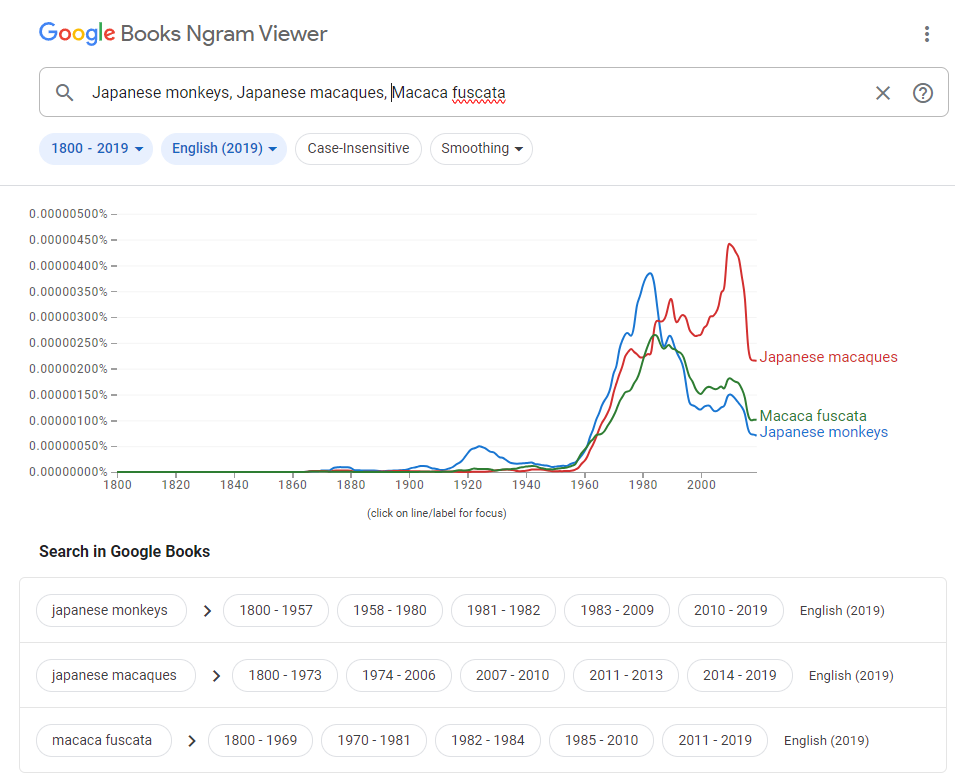

# 論文
論文との接し方がわからない...<br>
初めて論文を読むときに戸惑う人は多いだろう。<br>

お堅い、特殊な文章表現...<br>
諸々のことが論文を読むと降ってくる。<br>

**研究者は作家ではない**。<br>

ハリーポッターみたいと言わずとも、大学生・大学院生がスイスイ読めるような文章を書ける人なんて世界中見渡してもほとんどいない。論文はある程度フォーマットが決まっているものの、読みづらいことに変わりはないから、正直言って筆者は論文はあまり読む気になれない。<br>
論文を読むとき、独学でおいそれと簡単に理解できる人は少数だろう。<br>

筆者は、論文という生き物の生態がわからず、もがき、苦悩した。<br>
論文を読めるようになってきたのは修士論文を書き終わってから。<br>
遅きに失したというには遅すぎるくらい論文には苦労した。

**論文は全部読む必要なんてない。**

こう思えるだけでだいぶ救われる。<br>
そして、論文の作法は早く覚えるに越したことはないので、修士の前期のうちに身に着けておくべきことを書き記す。

論文などの学術書の探し方や読み方（複数のモードを使って読む）について、いくつかネットに転がっているが、科学史やメディア論を専門としている岡澤康浩氏がYouTube [@okazawa_yomikata]で解説しているので参照するとよいだろう。


## 論文の探し方
### 論文検索用エンジン
今日主流となっている論文の探し方は、ネット検索。たとえば、以下の表 \@ref(tab:SearchEngines) がある（筆者はもっぱらGoogle Scholar）。<br>

```{r SearchEngines, echo=FALSE}
library(gt)
library(gtExtras)
library(tidyverse)

data.frame("Engine" = c("Google Scholar", 
                        "Web of Science", 
                        "PubMed", 
                        "CiNii Research"),
           "Logo" = c("https://seeklogo.com/images/G/google-scholar-logo-EEEC8EE46B-seeklogo.com.png",
                      "https://libraries.emory.edu/sites/default/files/styles/coh_x_large/public/2022-07/Clarivate_Logo.png?itok=eDkE0toU",
                      "https://upload.wikimedia.org/wikipedia/commons/thumb/f/fb/US-NLM-PubMed-Logo.svg/250px-US-NLM-PubMed-Logo.svg.png",
                      "https://cir.nii.ac.jp/static/images/ci-home-research.png")) %>% 
  gt(caption = "代表的な検索エンジン") %>% 
  ##画像の挿入
  gt_img_rows(Logo, height = 35) %>% 
  ##列名の変更
  cols_label("Engine" = "論文検索エンジン",
             "Logo" = "ロゴ") %>% 
  gt_theme_espn() %>% 
  cols_align(align = "center")


  
```


以下、説明する際はGoogle Scholarであることをご容赦いただきたい。

### キーワード検索
探そうとするキーワードが果たしてどれくらい使われているのか気になる時がある。その時に[GoogleNgramViewer](https://books.google.com/ngrams/)が役に立つ。例えば、1990年代あたりから、Japanese monkeysはあまり使われなくなり、代わりにJapanese macaquesが増えていることがわかる（図 \@ref(fig:JapMonkeys)）。

```{r JapMonkeys, echo=FALSE, fig.cap="Google Books Ngram Viwerを用いたキーワード検索<br>"}

```


### 検索方法
自分の興味・関心のあるキーワードを英語で知る必要がある。<br>
これがわからないと検索はただただ苦痛。<br>
キーワードは、教科書や本の章タイトル、レビュー論文からかいつまんでいくと見つかる可能性が高まるだろう。

#### 芋づる式
どの論文でも引用されていることが多い。
新しめでよく引用されている論文から読むと効率がいいだろう。[Connected Papers](https://www.connectedpapers.com/)という論文検索アシストAIもある。これは引用されていない論文とのつながりもできるので、思わぬ発見があるかもしれない。

#### レビューを探す
検索時に、キーワードとともに"review"と打って検索するとレビュー論文がヒットしやすい。<br>
レビュー論文はそれまでのまとめであり。将来の展望について筆者が意見する論文である。本の場合、身内の論文ばかり引用していることがあるので注意が必要。

特集号が組まれていることがあるので、そこで一挙に情報収集できる可能性もある。

#### 和文で探す
意外と穴場になるのが和文論文である。<br>
各学会の〇〇賞受賞者が記念レビュー論文を書いているので、非常に参考になることが多い。

### 論文アラート
#### 出版社のサイトからアラート
自分の研究分野の論文はとにかくアラート。<br>
霊長類学の分野で言うと、以下の雑誌をアラートすれば英文は最新動向を把握しやすい。とにかく、自分の研究分野が載る雑誌をいち早く把握することは大事。

- 霊長類学系学術雑誌
  - *Primates* 
  - *International Journal of Primatology*
  - *American Journal of Primatology*
  - *American Journal of Biological Anthropology*
  - *Folia Primatologica*
  
霊長類学の範疇の超える発見や理論に興味・関心があるのであれば、以下が参考になる。

- 動物行動系学術雑誌 (やや専門)
  - *Animal Behaviour*
  - *Behavioural Processes*
  - *Behavioral Ecology and Sociobiology*
  - *Ethology*
  - *Behaviour*
  - *Behavioral Ecology*
  - *Journal of Ethology*
- 動物行動系学術雑誌（一般的）
  - *Nature*
  - *Science*
  - *Proceeding of Royal Society B*
  - *PNAS (Proceedings of National Academy of Sciences)*
  - *Current Biology* 


##### お気に入り登録
気になる雑誌を出している出版社をまずお気に入りバーに登録しよう。
論文検索用のブラウザーを作ると他とゴチャゴチャしなくて済むのでおすすめ。

##### 雑誌の登録
面倒くさいが登録すると後々らく。

#### 自分で設定したキーワードでアラート
例えば、"gorilla"をキーワード登録すると"gorilla"に引っかかる論文がアラートされる。
だが、しかし、思わぬ結果として霊長類のゴリラに関する論文よりむしろゴリラガラスに関する論文が山のように降ってくるので、キーワード登録には工夫がいる。

強そうに思われたいなら、マッチョガラスじゃだめですか？

#### アラート時の小技
論文用のメールアドレスを作る

## 論文の読み方
### 論文の構成から理解する

論文は、

1. **タイトル**: 究極の要約といっていい。

2. **要旨**: 自分の興味に合うのかのマッチングを行う文章。

3. **キーワード**: 論文検索時の大きな手掛かり。

4. **序論**: 論文で扱う分野のこれまでの経緯・著者の目的やモチベーションについて書かれている。

5. **方法**: 研究目的（or リサーチクエスチョン）を明らかにするためにおこなった調査方法・実験方法。

6. **結果**: 調査・実験結果

7. **考察**: 結果の解釈。

8. **結論**: 論文で伝えたい要点

から構成されている。<br>


研究者の卵は、まず自身が取り組む研究分野の枠組みを把握するために、要旨・序論・結論をあたり、多くの論文を読もう。<br>
50-100本ほど論文を読むと吸収する知識量が少なくなり、漸近線が見えてくるはず。<br>
論文丸々一本精読する義理は全くないし、読む必要がある論文はごく少数。

### 論文関連AI
論文初心者にとっての大きな助けとなるかもしれない（表 \@ref(tab:paperAI)）。

```{r paperAI, echo=FALSE}
data.frame("app" = c("Consensus",
                     "Gamma",
                     "SciSpace Copilot",
                     "Elicit"),
           "logo" = c("https://consensus.app/home/wp-content/themes/confluance/images/redesign/home/logo-full.png",
                      "https://uploads-ssl.webflow.com/62e823626cd4fdd0e5dc1527/62e823626cd4fdc26bdc1576_Gamma.svg",
                      "https://www.aitoolsclub.com/content/images/2023/08/Screenshot-2023-08-04-221152.png",
                      "https://blog.elicit.com/content/images/2023/09/elicit-logo-4.png")) %>% 
  gt(caption = "代表的な論文アシストAI") %>% 
  ##画像の挿入
  gt_img_rows(logo, height = 35) %>% 
  ##列名の変更
  cols_label("app" = "論文読解AI",
             "logo" = "ロゴ") %>% 
  gt_theme_espn() %>% 
  cols_align(align = "center")

```

Consensus
: リサーチクエスチョンに対して、関連するレビューや引用が多い論文を紹介してくれる。

Gamma
: 要望内容に応じてプレゼン資料を作成してくれる。論文のURLやDOIを入力するとその論文に関連する情報を視覚的に提供する。 

SciSpace
: 論文読解アシストAI。論文内容について質問するとチャット形式で返答してくれる。

Elicit
: リサーチクエスチョンに対して実在する論文を引用して返答してくれる。

## 論文の記録方法
論文は一生かけても読み切れない。それくらい膨大な論文数が日々生まれている。<br>
記録方法は何でもいいが、キャッシュ＆フローのキャッシュを増やすことが研究を行う上で必要不可欠。<br>
誰だって忘れてしまう、忘れるようになってしまう。<br>
いや、忘れることは悪いことではない。外山滋比古が言うように積極的に忘れて思考を整理しよう [@toyama1986]。<br>

**論文の情報をアウトソーシングすることで、頭の中に発想する空間をつくろう**。<br>


### 論文管理ソフト
論文を自分のPCにPDFで保存するだけではなかなか効率が悪い。
忘れたときの備忘録をつくることは研究上必須能力である。
論文管理ソフトには以下のようなものがある（表 \@ref(tab:PaperManager)）。どのソフトでもタブレットとPCの情報を同期できる。特に、タブレットで手書き入力できるのはありがたい。

```{r PaperManager, echo=FALSE}
library(gt)
library(gtExtras)
library(tidyverse)

data.frame("Engine" = c("Mendeley", 
                        "PaperPile", 
                        "EndNote"),
           "Logo" = c("https://upload.wikimedia.org/wikipedia/commons/8/81/Mendeley_Logo_Vertical.png",
                      "https://assets.st-note.com/production/uploads/images/94061679/4bba27c25d07a5df23a0321f014eb6fa.png",
                      "https://images.g2crowd.com/uploads/product/image/social_landscape/social_landscape_79d1e55423c4e496e5de32d1d55e2efb/endnote.png")) %>% 
  gt(caption = "代表的な論文管理ソフト") %>% 
  ##画像の挿入
  gt_img_rows(Logo, height = 35) %>% 
  ##列名の変更
  cols_label("Engine" = "論文管理ソフト",
             "Logo" = "ロゴ") %>% 
  gt_theme_espn() %>% 
  cols_align(align = "center")


  
```


### 研究ノート
筆者は捨て紙の裏にメモを書いていてよくなくすタイプだった。<br>
こんな書類を管理できない人やワーキングメモリーが大きくない人には研究ノートをお勧めする。<br>

筆者は研究だけでなく、日常生活のことも含めてすべてを書き込む「なんでもノート」を使うようになってから、ノイローゼの症状が緩和され、目の前の研究に取り組めるようになった（それでもノイローゼぽくなることはあるが全然マシ）。

とにかく頭がモヤモヤしたらこのノートに全部書いてみる。<br>
そしたら、頭がスカッとすることが案外多い。

後々繰り返し見返す内容はNotion^a^とか別の電子メモに書くことですぐに検索できるようにすると、検索ストレスがなく研究に取り組める。

---

a: NotionはEvernoteにとって代わる存在になり、ネットのスクラップ、メモ書きなど非常に役に立つ。ac.jpのメアドは年会費無料で使える。

**参考情報**

- 筆者が愛用しているなんでもノート<br>
ミドリノートMDノートA5方眼罫  （[Amazon](https://www.amazon.co.jp/%E3%83%9F%E3%83%89%E3%83%AA-%E3%83%8E%E3%83%BC%E3%83%88-MD%E3%83%8E%E3%83%BC%E3%83%88-%E6%96%B9%E7%9C%BC%E7%BD%AB-15003006/dp/B0091GBD00/ref=sr_1_1?__mk_ja_JP=%E3%82%AB%E3%82%BF%E3%82%AB%E3%83%8A&crid=2SHDINYM8A3LR&keywords=%E3%83%9F%E3%83%89%E3%83%AA%E3%83%8E%E3%83%BC%E3%83%88MD%E3%83%8E%E3%83%BC%E3%83%88A5%E6%96%B9%E7%9C%BC%E7%BD%AB&qid=1687032749&sprefix=%2Caps%2C524&sr=8-1)）

- なんでもノートを作るきっかけになった動画 [@kono_note]

### RMarkdown
筆者は、この文章をRmarkdownで作成している。筆者にとってRmarkdownは使い勝手がよく、使っていなかった時と比べて研究遂行スピードが上がったことを実感している。<br>
Rmarkdownは、溢れ出るアイデアをためてくれる記憶の栓であり、忘れて思い出せないというストレスが解消され、研究を進められる。<br>
詳細は、[Rの章](#How to R)で説明する。


## 論文投稿先の検討
### ジャーナルの検討

[SciRev](https://scirev.org/)
: 平均的な投稿過程がわかる。急いでいるときに参考になる。

[JournalGuide](https://www.journalguide.com/)
: タイトル、キーワードから合いそうなジャーナルを提案してくれる。

### インパクトファクターの調べ方
[Journal of Citation Reports](https://jcr.clarivate.com/jcr/home)
: 投稿先のインパクトファクターを検討したい場合に役立つ。

## 論文原稿の推敲
『ネイティブが教える 日本人研究者のための論文の書き方・アクセプト術』（エイドリアン・ウォールワーク(著),前平 謙二(翻訳),笠川 梢(翻訳)）は論文作成時の注意点について、「読者が読みやすい論文とは？」というシンプルな問いに基づきながら丁寧に解説している。

### ノンネイティブの英作文
[DeepL Write](https://www.deepl.com/write)
: DeepLには翻訳ツールとWriteの2つのサービスがある。英語から英語に直すときに参考になる。


### 剽窃チェックツール
人のいい文章をまねすることは英文執筆の上達に役立つが、そのまま書いてしまうと剽窃になってしまう。また、AIが発達が目覚ましい昨今、知らずうちに剽窃していたということもありうる。そこで、[iThenticate](https://www.ithenticate.com/)や[Turnitin](https://www.turnitin.jp/)などの剽窃チェックツールを使うことである程度防ぐことができるだろう。

