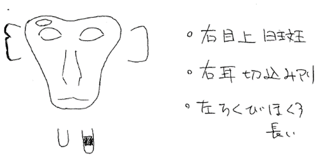

# 観察
ここでの観察とは、研究者が調査時に行う動物行動の直接観察のことをさす。<br>
動物の行動観察は一朝一夕で見につくものではない。<br>
how toの事柄のように思われるが、フィールドで行う直接観察は頭で考えている暇はなく、体で反応できないといけない。なので、観察する前に様々なことを想定し整理する必要がある。<br>
筆者の経験をもとに観察についてまとめていく。

## 識別方法
サルの個体識別と植物の識別について紹介する。

### 植物の識別
識別の際によく使われる本屋サイトを紹介する。

樹に咲く花（山と渓谷社） 
: 離弁花１、離弁花２、合弁花・単子葉・裸子植物の３冊１シリーズがステーションとじんるいの蔵書においてある。<br>

2 屋久島の植物（著：川原勝征）
: コンパクトにまとまっていてどの植物なのか全く見当がつかないときは便利。ステーションにおいてある。<br>

3 植物検索図鑑
: http://www.chiba-museum.jp/jyumoku2014/kensaku/　<br>
植物の特徴（葉の付き方、鋸歯の有無、葉脈、樹皮など）がわかるが本で解決できないときに役に立つ。

### サル観察時の注意
屋久島のサルは思いのほか近くで見れてしまうため、サルの警戒・ストレスのシグナルを見落とさないようにすることが欠かせない。サルを観察する際は

1. 見回し行動（visilance）
2. セルフスクラッチ

この二つを特に注意する必要がある。<br>

ビジランス
: サルに近づきすぎていると、サルは人のほうを何回か振り向く。この時点でもう近づきすぎである。<br>
しかし、人はサルの顔が映った写真を撮りたいと思うので知らぬ間に近づいていることに気づいていない。この些細なことに気づいて初めてサル屋のスタートである。

セルフスクラッチ
: ストレスを感じた時に体を手や足で掻く行動。セルフスクラッチもストレス行動の一種であるが、「近づきすぎ！」とサルが感じた時に出やすい行動がセルフスクラッチである。


### サルの個体識別
ここで挙げる例は識別できていない状態の人に向けた識別するうえでのヒントにすぎない。<br>
識別が一番上達する方法は、<br>

1. とにかく真摯に対象動物を見つめ、
1. スケッチ（似顔絵など）を描き、
1. 写真を撮る。<br>

このサイクルを続ける意外に上達する手段はない。識別ポイントは人によって違うことが多いので、他人がつくった識別情報はわからないことも多々ある。最後は結局自分自身で築き上げた判断基準から識別するしかない。<br>
ここでは、筆者の研究対象であったニホンザルを例に個体識別の方法を説明していく。

#### 個体の特徴を抑える
スケッチで書ける特徴を３つ、見つけてみよう。<br>
特徴が１つだけだと他個体と同じ特徴である可能性がまだ高い、２つでも心もとない。３つ見つけられれば、全く同じ特徴をもった紛らわしい個体（性・年齢も似通った個体）はいないはずだ。

**初心者レベル：識別表に書けること**

- 顔
- 手足の指
- 尾の長さ・曲がり具合
- 身体の大きさ・太り具合
- 乳首の長さ・ほくろの有無・左右の長さの偏り

**中級レベル：識別表に書けないこと**

- 毛並み
- 顔やお尻の色具合
- 声

**上級者レベル**

- 歩き方
- シルエット
- 顔の雰囲気


#### 個体識別の手順
慣れていない最初のうちは、持ち合わせている情報をフィルターリングすることで個体識別できる可能性がぐっと高まる。

1. **群れ識別**
1. **属性分け**
   1. **性・年齢クラス**<br>
  オス・メスの区別。アカンボウ・コドモ・ワカモノ・オトナの区別。
   1. **発情の有無**<br>
  季節性繁殖する動物では有効なことが多い。
   1. **子持ちの有無**<br>
  アカンボウの有無、子のきょうだい構成（性・年齢の組み合わせ）などから判断。
  
1. **周辺個体情報**<br>
よく近接している個体数のちがいや特徴をつかみやすい個体が近くにいるか等。アドリブサンプリングでとくかく近接個体を記録すると識別しやすくなる。


#### 似顔絵を描く
裸眼もしくは双眼鏡で分かる特徴を似顔絵にする。写真よりも敢えて抽象度を上げることでどこに注目すればいいのかが分かりやすくなる利点がある。
```{r sketch, fig.cap = "似顔絵の見本", echo = FALSE, out.width = "40%"}

```


#### 写真を撮る
**スマホはNG！**<br>
望遠機能がない、というのが一番の理由である。20-35倍の光学ズームができるとだいぶ識別するのに使える写真が撮れる。デジタルズームは画像が荒くなるので識別写真には不向き。

**適当な写真は使い物にならない！**<br>
写真は同じようにとってもサルの印象が変わってしまう。自分が識別しているときの顔の印象は、写真を撮ると別人になっていることは往々にして起こる。写真は思ったほど簡単ではない。動画も同じ。


## 観察方法
観察方法に関する本 @martin_bateson1990^,^ @inoue2013^,^ @dowkins2015 はいくつか出版されているので、詳細はそちらに譲る。ここでは、霊長類の追跡を例に調査で必要な観察法を紹介する。

まず1人で霊長類を観察するとなると、個体追跡か群れ追跡かの2択となる。これを前提に以後話を進める。

記録方法を列挙すると、

- 連続記録
- 全生起サンプリング (all occurence sampling)
- 瞬間サンプリング (instantanous sampling)
- ワンゼロサンプリング (one-zero sampling)
- アドリブサンプリング (ad libitum sampling)

がある。これらの記録方法は互いに排反なものではなく、自分の知りたい事象に応じて組み合わせることができる。ただし、システマティックな行動データにするためにはアドリブサンプリングを避け、それ以外の記録方法をとる。次にこれらの記録方法を使う場面を例を挙げて紹介する。

連続記録
: 秒単位で起こるような行動について記録することが多い。

全生起サンプリング
: 観察できたある行動について全ての事象を記録する。全てを記録できない場合アドリブサンプリングなってしまうので注意。自分が観察できる範囲（視野）をよく見極めてその範囲内で全て記録できるように工夫する必要がある。<br>
稀な行動について記録するときは有効な記録方法。<br>
e.g.) 追跡個体の半径10m以内の抱擁行動を記録する。

瞬間サンプリング
: 一定時間間隔（e.g. １分、５分など）ごとにその瞬間の行動を記録する。活動項目（activity budget）を記録する際によく使われる。

ワンゼロサンプリング
: 一定時間間隔の中で、着目している行動が起こったかどうかで記録する。

アドリブサンプリング
: 頻度や割合といった形でシステマティックに結果を出したい行動については使えない。しかし、敵対的交渉などあまり頻繁に観察できない行動を記録することで個体関係を確認する際は役立つ。<br>
また予備観察時に、個体識別や個体関係を理解することに役立つ。

---

フィールドワークに関する本は多数あるが、その中でも『君たちはどう生きるか[@yoshino1982]』（吉野源三郎著）を一読することをお勧めする。
